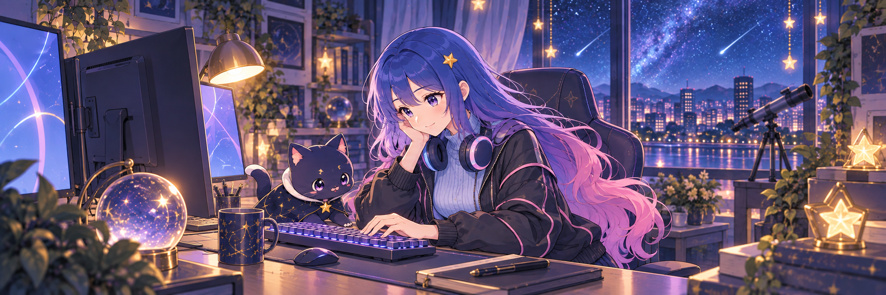
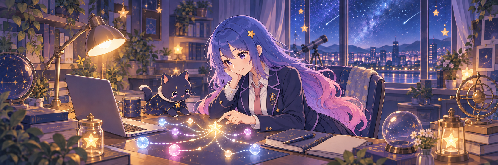
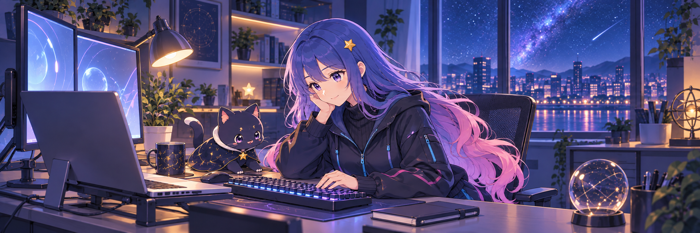

# Profile banner outfit previews

Generated with the built-in GPT Image tool on 2026-10-03. Pyuyi selected **B — Sweet-cool collegiate**, then requested a full-body view. The final refinement is saved as `assets/profile-banner-academy.png`; the three initial previews below are retained for reference.

- Reference: the profile's existing original researcher and star-cat banner (`assets/profile-banner.png`).
- Preserved identity: adult researcher, sapphire-blue to lavender/pink long hair, violet eyes, golden star hairpin, natural slender build; original navy star-cat.
- All three files are native 2172 × 724 (3:1), opaque PNGs, copied byte-for-byte from GPT Image output with no resizing or lossy compression.
- Original characters only. No readable text, logos, watermarks or third-party characters.

## A — Light cyber streetwear

Asset: `assets/banner-variants/street.png`.

### Final prompt

Use case: identity-preserve. Asset type: original GitHub profile banner, ultra-wide landscape 3:1, sharp high-resolution PNG, target around 2400x800 or larger. Input image 1: reference for the SAME original adult anime researcher and her navy star-cat; create a new outfit and scene while keeping her face, long sapphire-blue hair fading through lavender to cherry pink, violet eyes, small gold star hairpin, slender natural adult proportions and small bust. Variant A: sweet-cool light cyber streetwear. Wear an oversized charcoal-black cropped bomber jacket with delicate pink piping over a pale powder-blue high-neck knit top; large understated blue-and-pink over-ear headphones rest around her neck. No logos. She sits comfortably at a modern desk working on a mechanical keyboard, relaxed thoughtful confident small smile. Nearby her original adorable dark-navy cat with subtle gold star details watches. Nighttime research room with soft blue-violet screen glow, a warm accent desk lamp and starry window, tidy uncluttered tech desk, simple abstract monitor glow with NO readable text or symbols. Japanese 2D cute anime illustration, exceptionally clear clean expressive linework, crisp cel shading and controlled lighting, not painterly or fuzzy, cute but not childish, no chibi. Compose face, visible outfit and cat clearly in the central 70 percent of a balanced panoramic banner. Hair beautiful and flowing, outfit silhouette reads at small README sizes. Preserve original character identity but replace the previous cream blouse and cardigan completely. No text, letters, code, equations, title, logo, watermark, third-party characters, exaggerated anatomy or extra people. One complete illustration, not collage.

## B — Sweet-cool collegiate

Asset: `assets/banner-variants/academy.png`.

### Final prompt

Use case: identity-preserve. Asset type: original GitHub profile banner, very wide horizontal 3:1 panorama, sharp high-resolution PNG, target around 2400x800 or larger. Input image 1: character identity reference for the SAME original adult anime woman researcher and her navy star-cat, not a third-party character. Preserve her recognizable face, violet eyes, very long sapphire-blue hair fading through lavender to cherry pink, small gold star hairpin, natural slender adult build and small bust. Variant B: sweet-cool academic collegiate style, distinctly different from cyber streetwear. She wears a smart deep-navy collegiate jacket with lavender piping over a neat ivory collared shirt, a narrow dusty-pink necktie, and a dark pleated skirt subtly visible beside the desk. Fully clothed, modest, cute but visibly adult. No headphones or bomber jacket. Have her sitting at a cozy research desk with open laptop, closed notebooks, a simple pen and original dark-navy star-cat with gold star details nearby; a calm gently confident smile. Warm amber desk lamp, cool starry window and book shelves; elegant deep navy with pink and lavender accents, not overly cluttered. Clear high quality Japanese 2D anime line art and precise cel shading, not painterly or blurred, cute and quietly cool. Show head, torso, new jacket, tie and some skirt clearly within a balanced panoramic scene; face and star-cat within central 70 percent for mobile readability. Preserve character identity and hair but fully replace her previous cream blouse and powder-blue cardigan. No readable text, letters, code, mathematical symbols, title, logo, watermark, third-party characters, extra people, chibi proportions or sexualized anatomy. One full illustration, not collage.

## C — Functional geek techwear

Asset: `assets/banner-variants/techwear.png`.

### Final prompt

Use case: identity-preserve. Asset type: original GitHub profile README banner, sharp high-resolution ultra-wide 3:1 panorama PNG, target around 2400x800 or larger. Input image 1: identity reference for the SAME original adult anime woman researcher and her original star-cat. Keep her face, violet eyes, very long sapphire-blue hair transitioning through lavender to cherry pink, small golden star hairpin, natural slender adult proportions and small bust. Variant C: sweet-cool functional geek techwear, not a school uniform or soft cardigan. Dress her in a fitted but modest black-and-midnight-blue practical hooded technical jacket with asymmetrical zipper, simple functional pockets, tiny cyan zipper pulls and restrained pink seam accents over a plain dark high-neck top. Sleeves slightly loose; no logos, no military armor or weapons. Calm confident cute expression, adult researcher in her twenties. She is seated naturally beside a sleek workstation with mechanical keyboard, laptop and a small closed notebook; the original cute navy cat with gold stars sits next to her. Replace the ornate previous room with a tidy minimalist nighttime research workspace: cool cyan and lavender monitor light, a small warm desk lamp, simple shelves and a wide starry city window, fewer decorative objects and clean organized cables. Screen shows soft abstract glowing shapes only, no readable text, code or symbols. Japanese 2D anime aesthetics, sharp clean contours, crisp professional cel shading, a little bolder than the previous cozy image, sweet-cool and approachable, no soft-focus haze, no photorealism or 3D. Balanced panoramic composition with the woman's face, recognizable jacket and cat in central 70 percent; leave airy room context at edges. Preserve blue-pink hair and character identity; fully replace old blouse and cardigan. No text, numbers, equations, title, logos, watermark, copyrighted characters, extra people, childlike proportions or exaggerated anatomy. One full image, not collage.
