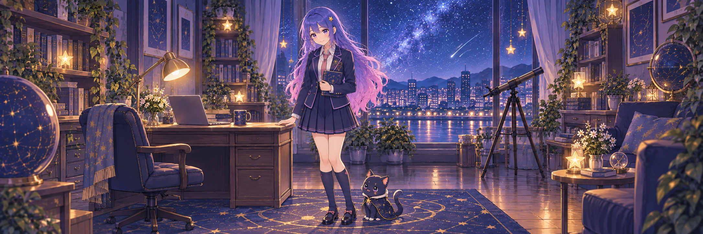

# Profile banner

- Final asset: `assets/profile-banner-academy.png`, native 2172 × 724 (3:1), opaque PNG.
- Generated with the built-in GPT Image tool on 2026-10-03.
- Pyuyi selected **B — Sweet-cool collegiate** and requested a complete full-body view.
- Reference: `assets/banner-variants/academy.png`, the original B preview. Initial character reference: `assets/profile-banner.png`, the previous original researcher and star-cat banner.
- Preserved identity: blue-to-lavender/pink long hair, violet eyes, golden star hairpin, natural slender adult build and the original navy star-cat.
- Outfit: navy collegiate-inspired jacket, ivory shirt, pink tie, dark pleated skirt, knee-high socks and Mary Jane shoes.
- Composition: full standing figure and both shoes unobstructed, with the star-cat beside her in a nighttime research room.
- Processing: copied byte-for-byte from GPT Image output; original pixels and dimensions preserved, no resizing or lossy recompression.
- A distinct filename avoids reusing the old banner's cached URL.
- Original characters only, with no third-party anime characters, readable text, logos or watermarks.
- [The three initial outfit previews and their complete prompts](banner-variants.md) are retained.

## Final prompt

Use case: identity-preserve. Asset type: GitHub profile anime banner, a complete ultra-wide 3:1 landscape illustration, high-resolution sharp opaque PNG, preferably around 2400x800 or larger. Input image 1 is the selected B collegiate outfit and original character identity reference. IMPORTANT PRIMARY CHANGE: show this SAME adult woman researcher in a FULL-BODY view from the very top of her head to the bottoms of BOTH shoes. Pull camera back and rebuild room perspective and scene as needed; do NOT make another seated bust or half-body portrait. No part of her hair, skirt, legs or feet is cut off, hidden behind desk, or touching frame boundaries. Both entire shoes fully visible with visible floor underneath, at least 5 percent headroom and 5 percent floor margin. The woman stands naturally beside (NOT behind) the research desk, full body unobstructed, a gentle confident smile and relaxed pose, one hand lightly holding a closed notebook. Keep the same recognizable face, violet eyes, golden star hairpin, waist-length sapphire-blue hair fading through lavender into cherry pink, slender natural adult build and small bust. She is an adult researcher in her twenties, not a schoolchild. Keep selected B outfit: tailored deep-navy collegiate-inspired jacket with fine lavender piping, ivory collared shirt, slim dusty-pink necktie, tasteful dark navy pleated skirt, plain navy knee-high socks and dark simple Mary Jane shoes with small pink details; fully clothed and modest, no thigh-highs, no sexualized posing or exaggerated anatomy. Her original cute dark-navy star-cat with gold stars sits next to her shoes, full cat clearly visible. Place full standing woman and cat as the central focus within central 60 percent of the wide panorama; use room context to fill sides, don't crop or add duplicate portraits. Nighttime scholarly workspace, wooden desk and laptop on one side, warm desk lamp, bookshelves, blue-purple starlit city window, subtle golden star decorations. Recompose furniture to emphasize visible figure and outfit, remove foreground objects that cover legs. Japanese 2D cute anime illustration with clear crisp linework, precise cel shading, navy/pink/lavender palette, warm-and-cool lighting, sweet-cool stylish atmosphere, not fuzzy or painterly. No readable text, code, letters, numbers, titles, logos, watermark or third-party characters. One single complete full-body scene, no collage or character sheet.
